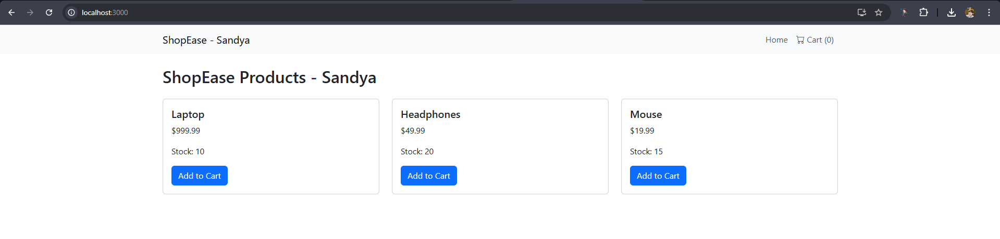
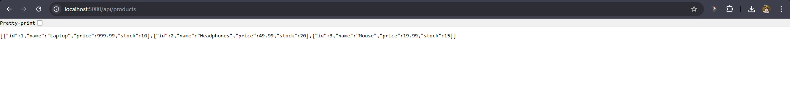
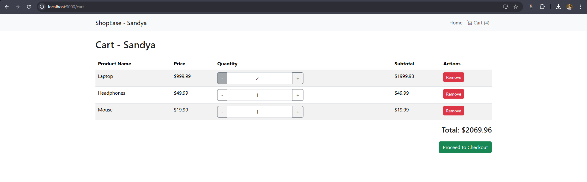
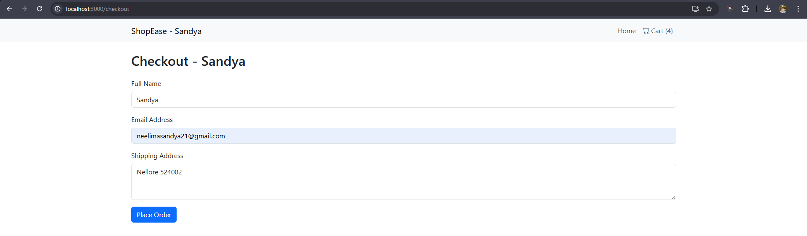
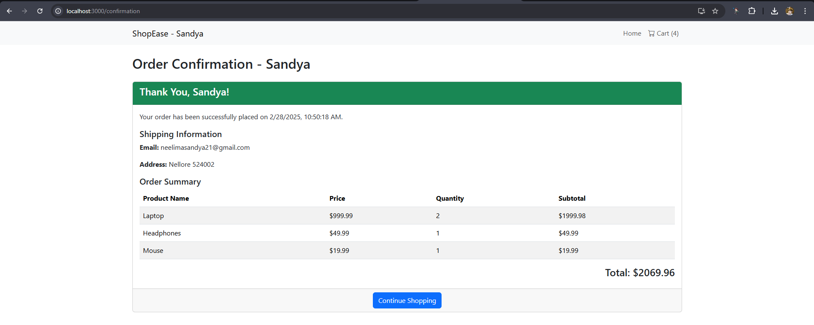

# Mini E-Commerce Cart System - Sandya

A simple e-commerce cart system built with **React** and **Node.js** as part of a coding activity for ShopEase, a startup. This project demonstrates a fully functional shopping experience, including product listing, cart management, checkout with form validation, and order confirmation, with persistence across page reloads.

- **Developer**: Sandya  
- **Duration**: 120 minutes  
- **Submission Date**: February 28, 2025  

---

## Table of Contents
1. [Features](#features)
2. [Technologies Used](#technologies-used)
3. [Project Structure](#project-structure)
4. [Setup Instructions](#setup-instructions)
5. [Usage](#usage)
6. [Screenshots](#Screenshots)

---

## Features
This project fulfills all user stories (US-1 to US-8) as outlined in the problem statement, plus an additional persistence feature:

- **US-1**: View available products fetched from a backend API.  
- **US-2**: Add products to the cart with instant UI updates.  
- **US-3**: View a cart summary with item names, quantities, prices, and total.  
- **US-4**: Update item quantities dynamically in the cart.  
- **US-5**: Remove items from the cart with instant UI updates.  
- **US-6**: Fill a checkout form (name, email, address) with Formik/Yup validation.  
- **US-7**: See an order confirmation page after submission.  
- **US-8**: Navigate between Home, Cart, and Checkout pages, with a protected checkout route.  
- **Extra**: Cart persistence across page reloads using `localStorage`.

---

## Technologies Used
- **Frontend**:  
  - React (v18)  
  - React Router DOM (v6) for navigation  
  - Bootstrap (v5) for styling  
  - Formik & Yup for form handling and validation  
  - Axios for API requests  
- **Backend**:  
  - Node.js with Express  
  - CORS for cross-origin requests  
  - Nodemon for development  
- **Persistence**: `localStorage` for cart state  

---

# ShopEase Project Structure

## Backend - ShopEaseBackend
ShopEaseBackend/
├── data/
│   └── products_Sandya.json       # Mock product data
├── server_Sandya.js               # Express server
├── package.json

## Frontend - ShopEaseFrontend_Sandya

ShopEaseFrontend_Sandya/
├── src/
│   ├── components/
│   │   ├── Cart_Sandya.js         # Cart summary and management
│   │   ├── Checkout_Sandya.js     # Checkout form with validation
│   │   ├── Confirmation_Sandya.js # Order confirmation page
│   │   ├── Navbar_Sandya.js       # Navigation bar with cart count
│   │   ├── ProductList_Sandya.js  # Product listing from API
│   │   ├── ProtectedRoute_Sandya.js # Route protection for checkout
│   ├── App_Sandya.js              # Main app with routing and state
│   ├── index.js                   # React entry point
├── public/
│   └── index.html                 # Includes Bootstrap Icons CDN
├── package.json

---

# Setup Instructions

Prerequisites

Node.js (v16 or higher)

npm (v8 or higher)

Backend Setup

Navigate to the backend directory:

cd ShopEaseBackend

Install dependencies:

npm install

Start the server:

npm start

The API will run on http://localhost:5000.

Frontend Setup

Navigate to the frontend directory:

cd ShopEaseFrontend_Sandya

Install dependencies:

npm install

Start the React app:

npm start

The app will run on http://localhost:3000.

Notes

Ensure the backend is running before starting the frontend.

The app fetches products from http://localhost:5000/api/products.

Usage

Home Page (/): Browse products and add them to your cart.

Cart Page (/cart): View your cart, update quantities, or remove items.

Checkout Page (/checkout): Fill out the form (name, email, address) to place an order. Requires a non-empty cart.

Confirmation Page (/confirmation): View order details after submission, then click "Continue Shopping" to reset.

Persistence

Cart items persist across page refreshes until checkout is completed and "Continue Shopping" is clicked.

## Screenshots

